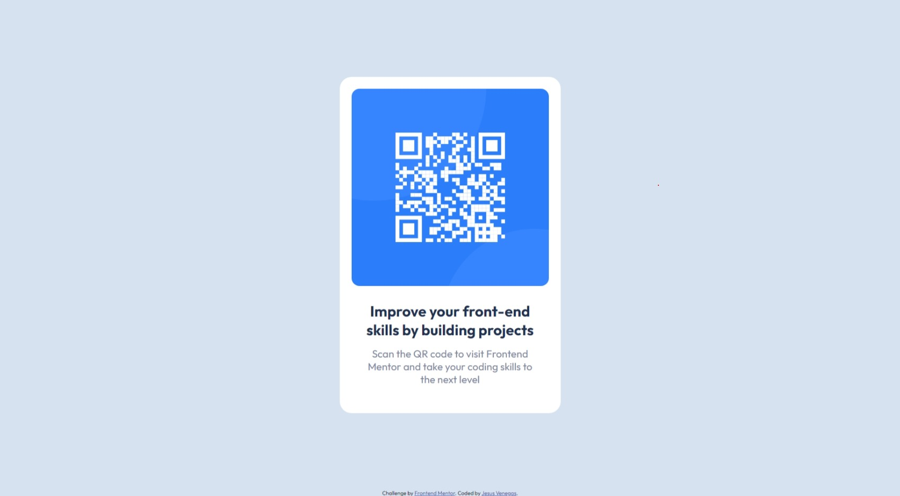

# Frontend Mentor - QR code component solution

This is a solution to the [QR code component challenge on Frontend Mentor](https://www.frontendmentor.io/challenges/qr-code-component-iux_sIO_H).

## Preview

## Links

- Solution URL: [Solution URL](https://www.frontendmentor.io/solutions/solution-using-flexbox-rJGFsLUWbO)
- Live Site URL: [Live Solution](https://kasdeya.github.io/qr-code-component/)

## Built with

- HTML5
- CSS

## Author

- Website - [Jesus Venegas](https://www.jesusvenegas.com) (WIP)
- Frontend Mentor - [@kasdeya](https://www.frontendmentor.io/profile/kasdeya)

## Acknowledgments

- Inspiration by [Front End Mentor](https://www.frontendmentor.io/)
